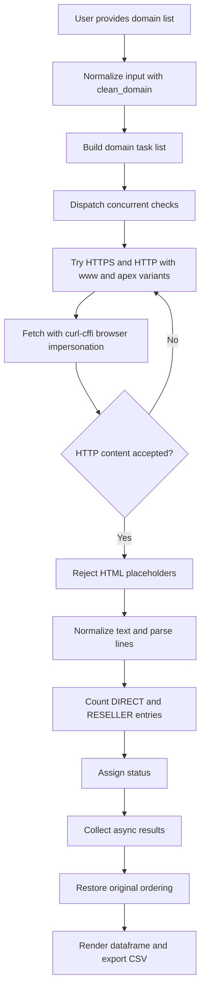
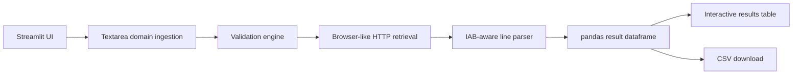

# App-ads.txt Mass Checker

A Streamlit-powered bulk validation utility for discovering, fetching, and assessing `app-ads.txt` files across large domain lists with browser impersonation and IAB-aware record parsing.

[](https://www.python.org/)
[](https://streamlit.io/)
[](https://github.com/lexiforest/curl_cffi)
[](#license)
[](#features)

> [!NOTE]
> This repository currently ships as a runnable Streamlit application rather than an importable Python package. The README therefore documents the project as an operational bulk-checking tool built on a compact single-file architecture.

## Table of Contents

- [Title and Description](#app-adstxt-mass-checker)
- [Features](#features)
- [Tech Stack & Architecture](#tech-stack--architecture)
  - [Core Stack](#core-stack)
  - [Project Structure](#project-structure)
  - [Key Design Decisions](#key-design-decisions)
- [Getting Started](#getting-started)
  - [Prerequisites](#prerequisites)
  - [Installation](#installation)
  - [Launching the Application](#launching-the-application)
- [Testing](#testing)
- [Deployment](#deployment)
- [Usage](#usage)
- [Configuration](#configuration)
- [License](#license)
- [Contacts & Community Support](#contacts--community-support)

## Features

- Bulk checks `app-ads.txt` availability for many domains in a single execution.
- Accepts raw domains or full URLs and normalizes them into canonical hostnames.
- Strips `www.` prefixes during preprocessing so the checker can evaluate both `www` and apex-domain variants.
- Attempts multiple fetch permutations automatically:
  - `https://www.<domain>/app-ads.txt`
  - `https://<domain>/app-ads.txt`
  - `http://www.<domain>/app-ads.txt`
  - `http://<domain>/app-ads.txt`
- Uses `curl-cffi` browser impersonation to mimic a modern Chrome client and improve compatibility with sites that block simplistic HTTP clients.
- Follows redirects during retrieval, allowing checks to succeed even when infrastructure rewrites to canonical hosts or CDNs.
- Filters out HTML error pages masquerading as successful `200 OK` text responses.
- Parses content using IAB-oriented heuristics and counts valid seller declarations based on `DIRECT` and `RESELLER` relationship types.
- Handles UTF BOM markers and mixed newline formats before record analysis.
- Distinguishes between a reachable but empty file and a file containing valid entries.
- Processes requests concurrently with `ThreadPoolExecutor` for higher throughput over large domain lists.
- Preserves the original input order in the final results table, even though validation is executed in parallel.
- Displays progress indicators and processed counters during execution.
- Exposes results in a Streamlit dataframe with conditional status styling.
- Supports one-click CSV export for ad-ops, compliance, marketplace QA, and publisher onboarding workflows.
- Keeps the implementation lightweight and easy to audit by concentrating all application logic into a small Python codebase.

> [!TIP]
> This tool is especially useful for ad-tech operations, publisher support, monetization audits, acquisition due diligence, and periodic seller-file compliance checks.

## Tech Stack & Architecture

### Core Stack

- `Python`: Primary implementation language.
- `Streamlit`: Web UI, execution shell, state handling, widgets, data display, and download actions.
- `pandas`: Result tabulation, sorting, CSV serialization, and dataframe presentation.
- `curl-cffi`: HTTP client used with browser impersonation to emulate a modern Chrome request profile.
- `concurrent.futures.ThreadPoolExecutor`: Parallel network execution for multi-domain throughput.
- `urllib.parse`: Host extraction and input normalization.
- `re`: IAB relationship token normalization and validation.

### Project Structure

```text
App-Ads.txt-mass-Checker/
├── app.py
├── README.md
└── requirements.txt
```

### Key Design Decisions

#### 1. Single-file application layout
The project intentionally keeps the runtime logic in `app.py`. This lowers maintenance overhead, reduces bootstrapping complexity for non-engineering operators, and makes auditing request/parsing behavior straightforward.

#### 2. Browser impersonation over plain requests
Many publisher sites, CDNs, and anti-bot layers treat simplistic HTTP clients differently from real browsers. The application uses `curl-cffi` impersonation to improve fetch success rates in cases where a naive `requests.get()` call would be blocked or downgraded.

#### 3. Multi-variant URL discovery
Real-world publisher infrastructure is inconsistent. Some sites only expose `app-ads.txt` on the apex domain, while others require the `www` host. The checker attempts both schemes and both hostname patterns to maximize discovery coverage without requiring operators to preprocess data manually.

#### 4. Content-aware validation
A successful HTTP status code is not enough. Some sites return custom HTML error templates with `200 OK`, which would create false positives. The project explicitly rejects likely HTML responses and then counts IAB-style lines based on relationship field validation.

#### 5. Parallel execution with stable output ordering
Network operations are I/O-bound, so concurrency materially improves throughput. The implementation preserves original row ordering after parallel execution so exported reports remain aligned with the source list supplied by the operator.

#### 6. Result semantics optimized for operations teams
The application emits simple status categories that are easy to scan in a table or CSV:

- `Valid`
- `File Empty (0 lines)`
- `Error`

#### Request and validation flow



#### Runtime architecture overview



> [!IMPORTANT]
> The parser currently treats a file as valid when at least one cleaned line contains a third comma-separated field resolving to `DIRECT` or `RESELLER`. It does not yet perform full IAB schema validation for every field.

## Getting Started

### Prerequisites

Before launching the application, ensure the following are available on your workstation, CI runner, or deployment target:

- `Python 3.10` or newer recommended.
- `pip` for dependency installation.
- Network egress to publisher domains being checked.
- A shell environment capable of running `streamlit`.

Optional but recommended:

- A Python virtual environment such as `venv`.
- `git` for cloning and version pinning.

### Installation

Clone the repository and install dependencies:

```bash
git clone https://github.com/ostinua/app-ads.txt-mass-checker.git
cd App-Ads.txt-mass-Checker
python -m venv .venv
source .venv/bin/activate
pip install --upgrade pip
pip install -r requirements.txt
```

If you are using Windows PowerShell:

```powershell
python -m venv .venv
.\.venv\Scripts\Activate.ps1
pip install --upgrade pip
pip install -r requirements.txt
```

### Launching the Application

Start the Streamlit server:

```bash
streamlit run app.py
```

By default, Streamlit prints a local URL similar to `http://localhost:8501`.

> [!TIP]
> For reproducible deployments, pin dependency versions in `requirements.txt` before promoting the app into shared infrastructure.

## Testing

The repository does not currently include an automated unit or integration test suite. Validation is therefore focused on runtime checks, static verification, and manual smoke testing.

### Recommended quality checks

Syntax validation:

```bash
python -m py_compile app.py
```

Dependency installation validation:

```bash
pip install -r requirements.txt
```

Application smoke test:

```bash
streamlit run app.py
```

Optional linting if you use local tooling:

```bash
python -m pip install ruff
ruff check app.py
```

### Suggested future test coverage

To mature the project, consider adding tests for:

- Domain normalization edge cases.
- HTML placeholder detection.
- IAB line parsing and seller relationship extraction.
- Empty-file handling.
- URL fallback order and retry behavior.
- Dataframe ordering guarantees under concurrent execution.

> [!WARNING]
> Because the application performs live network requests, integration-style tests may be nondeterministic unless you mock HTTP responses or capture fixtures.

## Deployment

This project is simple to deploy because it is a single-process Streamlit application with a minimal Python dependency set.

### Production deployment guidance

1. Build an isolated Python environment.
2. Install dependencies from `requirements.txt`.
3. Run the application behind a process supervisor or container runtime.
4. Expose the Streamlit port through your reverse proxy or internal platform.
5. Restrict access if the checker will process sensitive publisher inventories.

### Example direct process launch

```bash
streamlit run app.py --server.address 0.0.0.0 --server.port 8501
```

### Example systemd-style execution concept

```ini
[Unit]
Description=App-ads.txt Mass Checker
After=network.target

[Service]
WorkingDirectory=/opt/app-ads-checker
ExecStart=/opt/app-ads-checker/.venv/bin/streamlit run app.py --server.address 0.0.0.0 --server.port 8501
Restart=always
User=www-data

[Install]
WantedBy=multi-user.target
```

### Example Dockerfile

```dockerfile
FROM python:3.11-slim

WORKDIR /app
COPY requirements.txt ./
RUN pip install --no-cache-dir -r requirements.txt
COPY app.py ./

EXPOSE 8501
CMD ["streamlit", "run", "app.py", "--server.address=0.0.0.0", "--server.port=8501"]
```

### CI/CD considerations

A practical pipeline for this repository should include:

- Dependency installation.
- Static syntax checks.
- Linting.
- Optional mocked parser tests.
- Packaging or container build validation.
- Deployment to the target runtime if all gates pass.

> [!CAUTION]
> Large batches may generate significant outbound traffic and increase execution time depending on target-domain latency, redirects, and rate-limiting behavior.

## Usage

### Basic workflow

1. Launch the application with `streamlit run app.py`.
2. Paste one domain or URL per line into the input field.
3. Click `Run Check`.
4. Monitor progress while concurrent checks execute.
5. Review the resulting status table.
6. Export the CSV report if needed.

### Example input

```text
hyperhippo.com
google.com
https://example.com/path/to/app
www.publisher-site.org
```

### What the application does with each line

- Trims whitespace and quotation marks.
- Adds a scheme if one is missing.
- Extracts the hostname.
- Removes `www.` from the normalized base domain.
- Attempts multiple host and protocol combinations.
- Parses the discovered `app-ads.txt` body and counts valid IAB-style rows.

### Practical code examples

Although this project is currently delivered as a Streamlit app, the core functions are simple enough to understand independently.

#### Normalize a user-supplied domain

```python
from app import clean_domain

raw_value = '"https://www.example.com/some/path"'
normalized = clean_domain(raw_value)
print(normalized)  # example.com
```

#### Count valid IAB lines from file content

```python
from app import count_valid_lines

content = """
google.com, pub-1234567890, DIRECT
example.com, abc-999, RESELLER # inline comment
invalid line
"""

valid_records = count_valid_lines(content)
print(valid_records)  # 2
```

#### Resolve a domain and inspect the computed status

```python
from app import check_domain_smart

url, status, valid_lines = check_domain_smart("example.com")
print(url)         # final URL that succeeded, or default fallback URL
print(status)      # Valid | File Empty (0 lines) | Error
print(valid_lines) # integer count of valid lines
```

#### Typical user flow in the UI

```text
Input domain list
    -> normalize hostnames
    -> fetch app-ads.txt using browser impersonation
    -> reject HTML placeholder pages
    -> parse IAB relationship rows
    -> display results and export CSV
```

## Configuration

The repository does not currently expose a dedicated `.env` file, CLI abstraction layer, or YAML/TOML configuration file. Most behavior is encoded directly in `app.py`.

### Hard-coded runtime settings

The following operational defaults are currently embedded in the implementation:

| Setting | Current Value | Description |
| --- | --- | --- |
| Page title | `App-ads.txt Checker` | Browser and Streamlit page title. |
| Layout | `wide` | Streamlit page layout mode. |
| Page icon | `🛡️` | Visual identifier in the browser tab. |
| HTTP impersonation | `chrome120` | Browser profile used by `curl-cffi`. |
| Request timeout | `15` seconds | Per-request timeout for remote fetches. |
| Redirect handling | `True` | Enables redirect following. |
| Concurrency | `10` workers | Maximum `ThreadPoolExecutor` parallel tasks. |
| Output statuses | `Valid`, `File Empty (0 lines)`, `Error` | Result categories shown in the table/export. |

### Streamlit startup flags

You can customize runtime behavior using standard Streamlit flags when starting the app:

```bash
streamlit run app.py --server.address 0.0.0.0 --server.port 8501
```

Commonly useful flags include:

- `--server.address`: Bind to a specific interface.
- `--server.port`: Override the default port.
- `--server.headless true`: Useful for remote or containerized execution.
- `--browser.gatherUsageStats false`: Disable Streamlit telemetry if desired.

### Dependency configuration

Current Python dependencies are declared in `requirements.txt`:

- `streamlit`
- `pandas`
- `curl-cffi`

### If you want environment-based configuration later

A reasonable future enhancement would externalize the following values into environment variables:

| Environment Variable | Suggested Purpose |
| --- | --- |
| `APP_ADS_TIMEOUT` | Override HTTP timeout. |
| `APP_ADS_MAX_WORKERS` | Control concurrency. |
| `APP_ADS_IMPERSONATE` | Change browser impersonation profile. |
| `APP_ADS_ALLOW_REDIRECTS` | Toggle redirect following. |
| `STREAMLIT_SERVER_PORT` | Override app port in managed environments. |

> [!NOTE]
> As of the current implementation, these environment variables are not yet consumed by the application; they are recommendations for future extensibility.

## License

The project documentation currently targets the MIT License for open-source usage.

> [!IMPORTANT]
> The repository does not currently include a `LICENSE` file. To make the licensing position legally explicit, add an MIT license file before publishing or distributing the project broadly.

## Contacts & Community Support

## Support the Project

[](https://www.patreon.com/OstinFCT)
[](https://ko-fi.com/fctostin)
[](https://boosty.to/ostinfct)
[](https://www.youtube.com/@FCT-Ostin)
[](https://t.me/FCTostin)

If you find this tool useful, consider leaving a star on GitHub or supporting the author directly.
